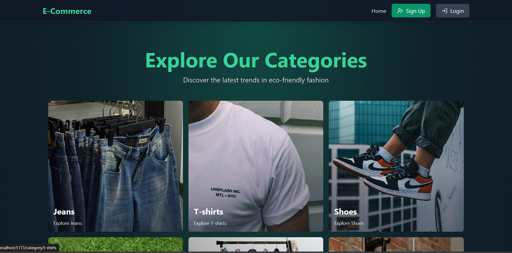
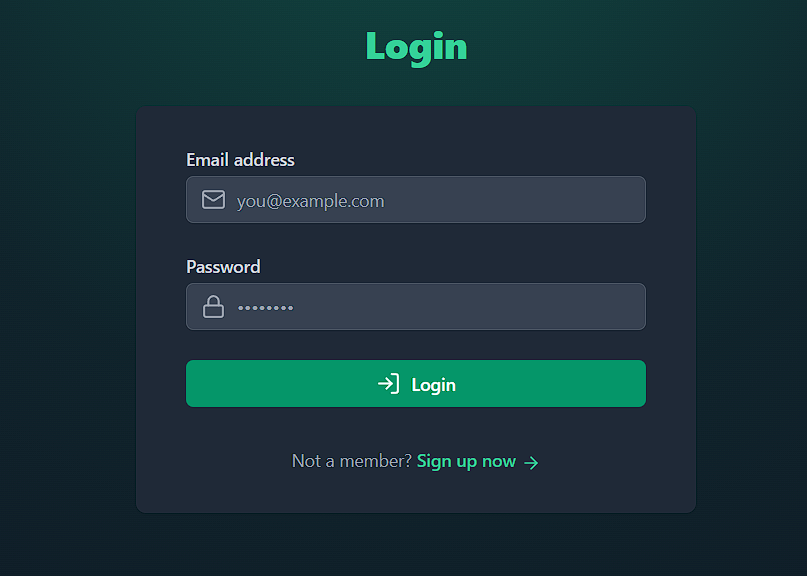
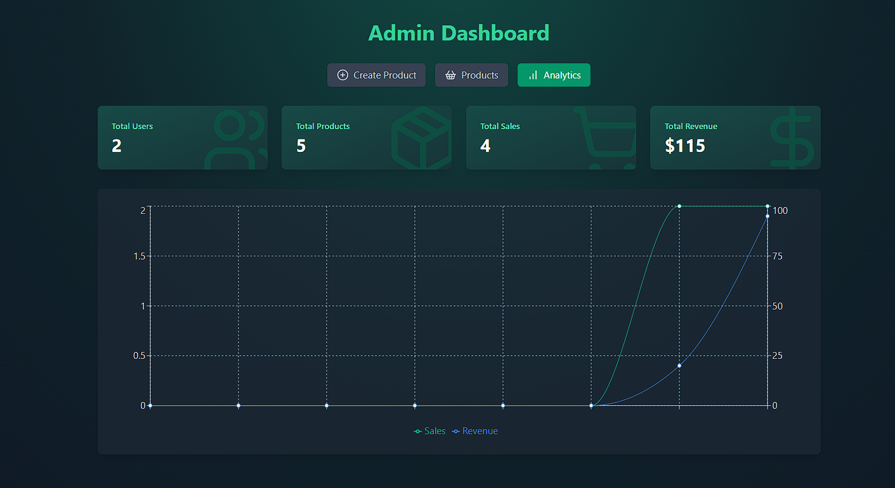
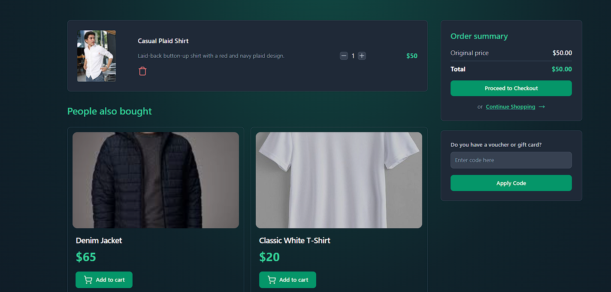
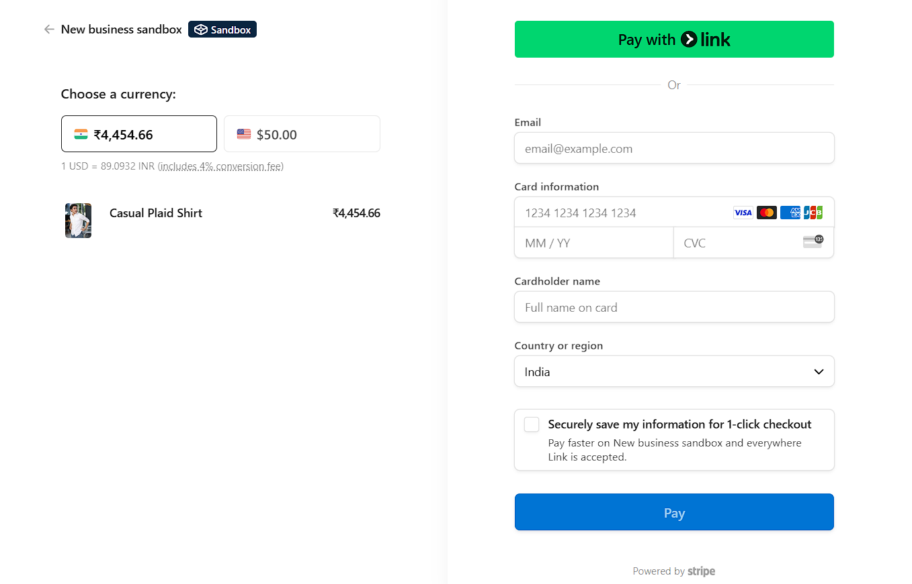

<h1 align="center">🛒 Streamify E-Commerce Store</h1>

  

  A full-featured, modern e-commerce platform built with MERN stack, featuring secure authentication, payment integration, admin dashboard, and more.

---

### 🚀 Live Demo (Optional)
<!-- Replace with your live link -->
[🌐 Visit Live Site](https://your-deployment-link.com)

---

### 🔧 Tech Stack

- **Frontend**: React, TailwindCSS, Zustand, Stripe.js
- **Backend**: Node.js, Express.js, Mongoose, Redis
- **Database**: MongoDB (Atlas)
- **Auth**: JWT with Refresh & Access Tokens
- **Cloudinary**: Image upload & storage
- **Payments**: Stripe Checkout Integration
- **Caching**: Redis (Upstash)

---

### ✨ Features

- 🔐 User Authentication (JWT, refresh tokens)
- 🛒 Shopping Cart with Quantity Management
- 💳 Stripe Payment Gateway Integration (Test Mode)
- 🏷️ Coupon Code System
- 📦 Product & Category Management
- 🧑‍💼 Admin Dashboard
- 📊 Sales Analytics
- 🖼️ Cloudinary Image Uploads
- 🚀 Redis-based Caching
- 🔄 Robust Token Handling
- 💡 Fully Responsive UI with 32+ theme options (optional if implemented)

---

## 📸 Screenshots
<!-- You place the image section here -->

  
  
  
  
  

## 🛠️ Environment Variables
<!-- Add this after screenshots -->
PORT=5000
MONGO_URI=your_mongo_uri
UPSTASH_REDIS_URL=your_redis_url
ACCESS_TOKEN_SECRET=your_access_token_secret
REFRESH_TOKEN_SECRET=your_refresh_token_secret
CLOUDINARY_CLOUD_NAME=your_cloud_name
CLOUDINARY_API_KEY=your_api_key
CLOUDINARY_API_SECRET=your_api_secret
STRIPE_SECRET_KEY=your_stripe_secret_key
CLIENT_URL=http://localhost:5173
NODE_ENV=development

# Install backend dependencies
cd backend && npm install

# Install frontend dependencies
cd ../frontend && npm install

# Build frontend
npm run build

# Start backend server
cd ../backend && npm run start

## License

This project is licensed under the [MIT License](./LICENSE).